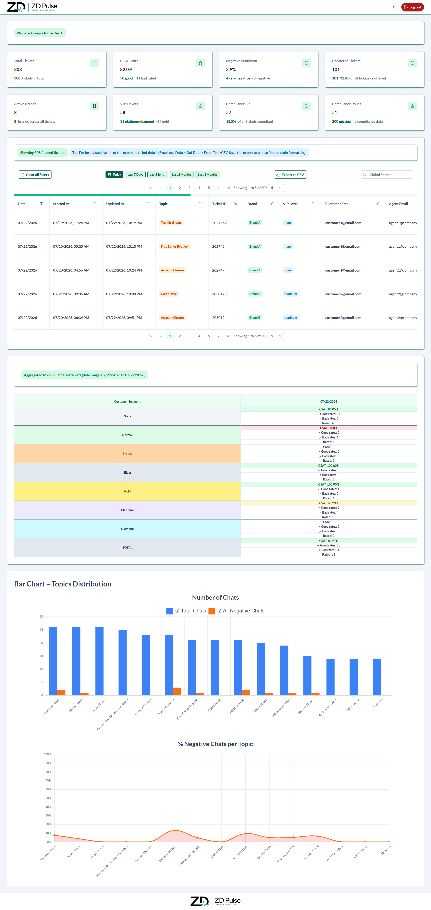
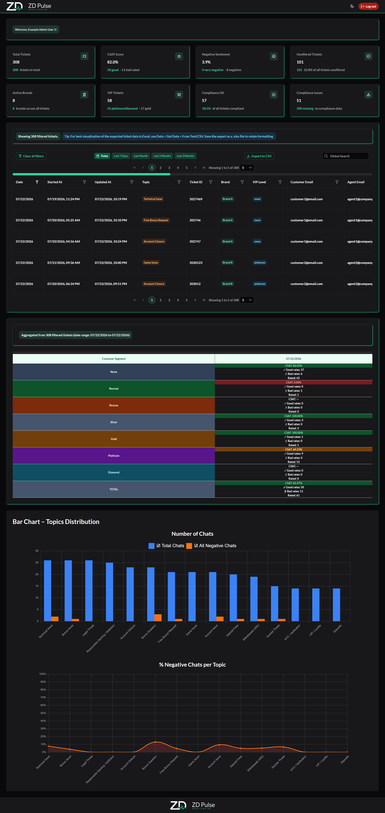
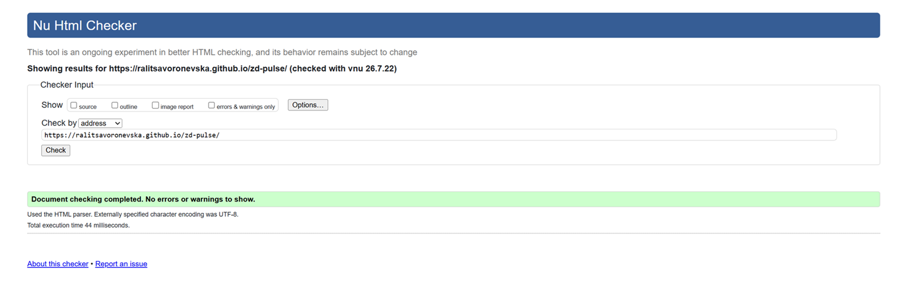
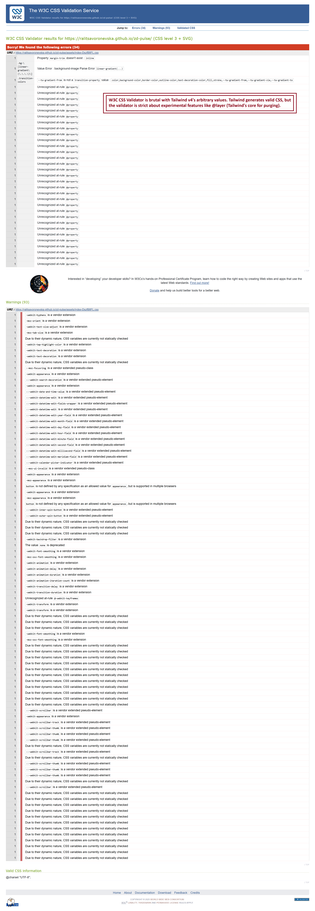
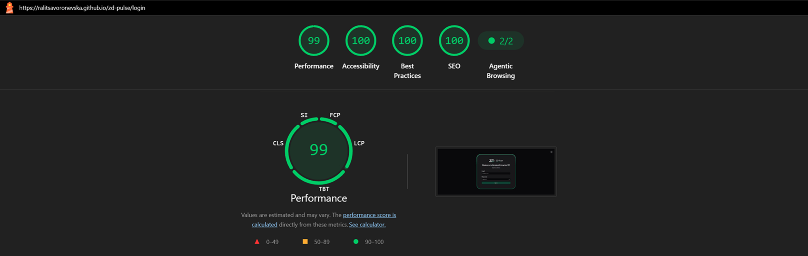
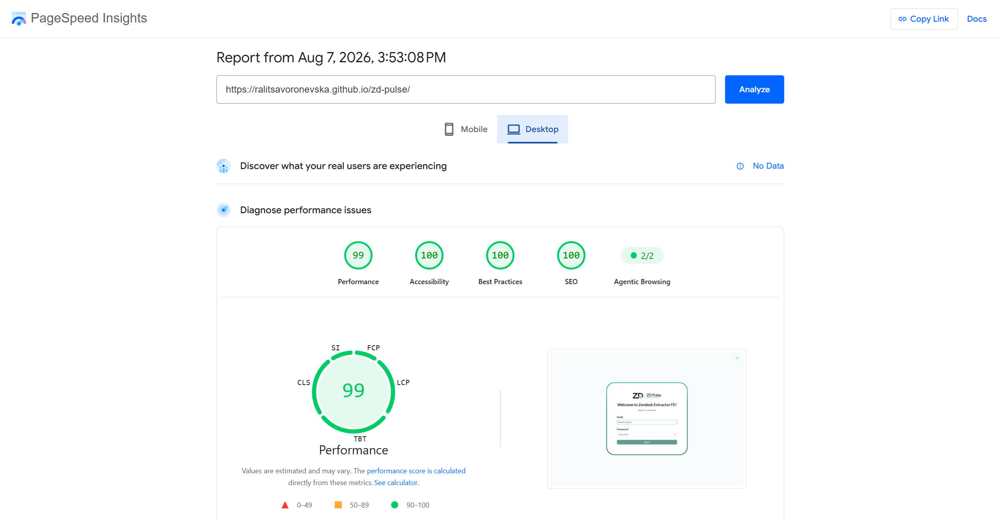
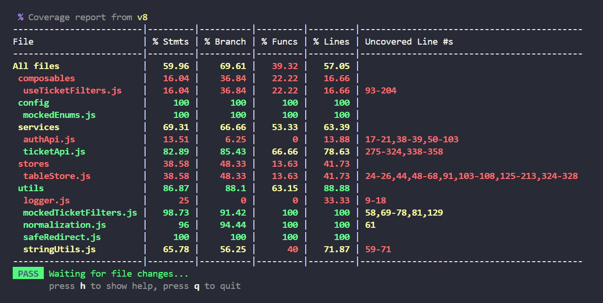

# 🧮 Zendesk Pulse

🔗 [Live GitHub Preview](https://ralitsavoronevska.com/zd-pulse/)

<details>
<summary>📸 Screenshots</summary>

<br>

<table width="100%">
  <thead>
    <tr>
      <th style="text-align: center;">🖥️ Desktop Light</th>
      <th style="text-align: center;">🖥️ Desktop Dark</th>
    </tr>
  </thead>
  <tbody>
    <tr>
      <td width="50%"></td>
      <td width="50%"></td>
    </tr>
  </tbody>
</table>

<br>

# 🏅 W3C HTML Validator



<br>

# 🏅 W3C CSS Validator



<br>

# 🌈 Chrome LightHouse Audit

Desktop:


<br>

# ⚡ PageSpeed Insights Results

Desktop:


</details>  
        
<br>

</details>

<br>

# 🛠️ Built with:


    
    



🔨 Transitions, Animations, Grid & Flex Layout  
⛏️ [Google Font: Lato](https://fonts.google.com/specimen/Lato/)

Zendesk Pulse is based on the [Sakai PrimeVue Theme](https://github.com/primefaces/sakai-vue) with [Live View](https://sakai.primevue.org/).

Zendesk Pulse is a Vue 3 SPA for extracting, filtering, and visualizing Zendesk support ticket data.

Currently Zendesk Pulse has been developed for Desktop usage only and in 2 modes - development and production.

<br>

# ✨ Features:

✅ Dual authentication: **Firebase Auth + Firestore (active in dev)** for role-based access,  
or **Django JWT (active in production)** for role-based access with access/refresh tokens  
✅ Analytics dashboard with charts (topic distribution, sentiment breakdown)  
✅ Advanced multi-criteria filtering (brand, topic, CSAT, sentiment,  
agent/customer email, date range, chat tags, transcript search)  
✅ Dark/light mode toggle (persisted to localStorage)  
✅ VIP customer tracking table  
✅ CSV export with size warnings

<br>

# Why this demo runs on Firebase (not Django/AWS)

This project is company property, and while I built the frontend, the Django + AWS backend is work
I wasn't involved in - so I can't showcase that part publicly. For this demo, the app runs in
Firebase mode instead, which handles authentication independently of the backend.

I'm on Firebase's free 30-day plan, started on September 8th and ending on October 8th.
If login isn't working when you try, it's most likely because that free trial has expired.

<br>

## Environment Variables

| Variable               | Purpose                                                                                                   |
| ---------------------- | --------------------------------------------------------------------------------------------------------- |
| `VITE_USE_MOCKED_DATA` | `true` to load local mock JSON instead of API (comment out to disable)                                    |
| `VITE_API_BASE_URL`    | axios `baseURL` for `authApi.js` (default: empty — requests go to same origin and rely on the Vite proxy) |
| `VITE_USE_FIREBASE`    | `true` to use Firebase Auth + Firestore instead of Django JWT (active in dev)                             |
| `VITE_API_URL`         | Dev-server proxy target for `/api/*` (fallback: `http://13.53.64.132`)                                    |

API proxy (dev only): `/api/` → `VITE_API_URL` or `http://13.53.64.132` (configured in `vite.config.mjs`)

<br>

## Mock data maintenance

`src/services/mocked-ticket-summaries.json` is a static fixture (~1541 tickets). Because dates are baked in, the dataset drifts out of the active quick-filter windows over time. The `scripts/refresh-mock-dates.mjs` script keeps it usable.

```bash
npm run refresh-mock-dates
```

**What it does** — redistributes every ticket's `timestamp` so the dataset is evenly split across the 5 non-overlapping ranges that correspond to the UI quick filters, using the same local-midnight boundaries as `useTicketFilters.js`:

| Bucket               | Span     | Approx. row count |
| -------------------- | -------- | ----------------- |
| today                | 1 day    | ~308              |
| 1-7 days ago         | 7 days   | ~308              |
| 1 week - 1 month ago | ~23 days | ~308              |
| 1-2 months ago       | ~30 days | ~308              |
| 2-3 months ago       | ~30 days | ~309              |

Cumulative counts seen when clicking the quick-filter buttons: Today 308, Last 7 Days 616, Last Month 924, Last 2 Months 1232, Last 3 Months 1541.

**Invariants preserved** (every date field in a ticket shifts by the same per-ticket delta):

- `timestamp === updated_at` — required by the backend contract and verified by the app
- every timestamp embedded in `chat_transcript` / `email_transcript` ≥ the ticket's `started_at`

**Idempotent-ish** — re-running after the calendar has advanced re-equalizes around the new "today". Running twice in the same second is essentially a no-op.

**Format preservation** — embedded transcript timestamps keep their original fractional-digit width (`.SSSSSS`) and timezone suffix (`Z` / `+00:00`). Ceiling-round on output prevents shifting into a lower-precision format from silently rounding a value _below_ the intended target.

<br>

## Testing

```bash
npm run test       # watch mode (vitest)
npm run test:run   # single run, CI-friendly
```

**Stack** — Vitest 4 + happy-dom (preferred over jsdom for Vue + faster startup). Config lives in [vitest.config.mjs](vitest.config.mjs) (separate from `vite.config.mjs` so test runs don't pull in the repository base path, manual chunks, primeicons font rewriter, or the mock-data exclusion plugin — the last one would silently empty the mock fixture during tests).

**Scope** — colocated `*.test.js` next to the source under test:

| File                                                                                 | Covers                                                                                                                                                                                                                                                                                                                                                        |
| ------------------------------------------------------------------------------------ | ------------------------------------------------------------------------------------------------------------------------------------------------------------------------------------------------------------------------------------------------------------------------------------------------------------------------------------------------------------- |
| [src/composables/useTicketFilters.test.js](src/composables/useTicketFilters.test.js) | `createInitialFilters` ↔ `extractFilterParams` contract — pins the regression-prevention against "added a filter but forgot to extract it"                                                                                                                                                                                                                    |
| [src/services/ticketApi.test.js](src/services/ticketApi.test.js)                     | All seven `build*Params()` builders + the `isExportBlocked` predicate — what each MUST include, MUST omit, and how special cases (`ticketid`, empty arrays, sort direction, pagination) are shaped. The `isExportBlocked` block uses `it.each` over every blocking filter so adding a new filter forces a test update                                         |
| [src/stores/tableStore.test.js](src/stores/tableStore.test.js)                       | `setSingleTicketAggregations` shape contract — null-clears all three refs; CSAT/sentiment/VIP/compliance bucketing; topic chart percent_negative; VIP CSAT segments/dates/data/totals shape (TZ-tolerant date assertions); string-vs-Date timestamp parsing. Pinia is set up fresh per test via `setActivePinia(createPinia())` — no `@pinia/testing` mocking |
| [src/utils/mockedTicketFilters.test.js](src/utils/mockedTicketFilters.test.js)       | `applyMockedTicketFilters` single-pass loop — every filter type isolated against a 5-ticket fixture                                                                                                                                                                                                                                                           |
| [src/utils/normalization.test.js](src/utils/normalization.test.js)                   | `emptyToNone`, `normalizeFilterOptions`, `normalizeTranscript`, `LOWERCASE_FIELDS` contract                                                                                                                                                                                                                                                                   |
| [src/utils/safeRedirect.test.js](src/utils/safeRedirect.test.js)                     | Open-redirect defence — every rejection rule named (absolute URLs, protocol-relative, `/login` ping-pong, etc.)                                                                                                                                                                                                                                               |

**Out of scope by design** — composable-mount tests, full store fetch-action tests (axios mocking), and component render tests aren't in the suite. Per the project's "no future-proofing, no premature abstraction" rule, those land when the first real need does (e.g. a regression that pure-function and pinned-shape tests couldn't have caught).

**Date assertions are TZ-tolerant** — `ticketApi.test.js` matches ISO prefixes (`/^2026-04-01T/`) so the suite doesn't flake on the runner's local TZ.

<br>

# FireBase + FireStore credentials:

Admin User:  
email: testadminuser1@example.com  
password: testadminuser1

Viewer User:  
email: testvieweruser1@example.com  
password: testvieweruser1

<br>

# 🚀 Sakai PrimeVue Theme

Sakai is an application template for Vue based on the [create-vue](https://github.com/vuejs/create-vue),
the recommended way to start a Vite-powered Vue projects.

<br>

# 🧰 Online resources and tools:

🖼️ [Photopea [Online Photo Editor]](https://www.photopea.com/)

<br>

# 🌐 Browser Support:

(Last updated and tested: 07/08/2025)  
🌟 Chrome 151.0.7922.109 (64-bit)  
🦊 Firefox 153.0.3 (64-bit)  
🏴‍☠️ Opera 134.0.5954.46 (64-bit)  
🪟 Edge 151.0.4129.72 (64-bit)

<br>

# 🧪 Online Validators:

✔️ [W3C HTML Validator](https://validator.w3.org/)  
✔️ [W3C CSS Validator](https://jigsaw.w3.org/css-validator/)  
💡 [LightHouse Audit](https://developers.google.com/web/tools/lighthouse/)  
⚡ [PageSpeed Insights Audit](https://pagespeed.web.dev/)  
⭐ [WebPageTest](https://www.webpagetest.org/)

<br>

## Setup

Make sure to install the dependencies:

```bash
# npm
npm install
```

<br>

## Development Server

Start the development server on `http://localhost:5173`:

```bash
# npm
npm run dev
```

<br>

## Production

Locally preview the production build:

```bash
# npm
npm run preview
```

<br>

## GitHub Pages — automatic

Push to `master`:

```bash
git push origin master   # → CI builds & publishes to GitHub Pages
```

This triggers the [`Deploy to GitHub Pages`](.github/workflows/deploy.yml) workflow, which runs `npm ci`, builds the app with `npm run build`, uploads the `dist` folder as a Pages artifact, and deploys it via `actions/deploy-pages@v4`.

Firebase config is injected at build time from repo secrets (`VITE_FIREBASE_API_KEY`, `VITE_FIREBASE_AUTH_DOMAIN`, `VITE_FIREBASE_PROJECT_ID`, `VITE_FIREBASE_STORAGE_BUCKET`, `VITE_FIREBASE_MESSAGING_SENDER_ID`, `VITE_FIREBASE_APP_ID`). Watch the **Actions** tab; once the workflow succeeds the site should be published.

The build is configured for the GitHub Pages sub-path (`base: '/zd-pulse/'` in `vite.config.mjs`), so it is deployed correctly under that repository path.

<br>

# 🌟 Inspiration & Credits:

🪄 [Claude AI](https://claude.ai/)  
:octocat: [GitHub Coplit](https://github.com/features/copilot/)

---

🙌 Thank you for checking out my project! More is coming 🔜.  
Stay tuned 🚀 and please don't forget to give the project a star! ⭐  
Made with lots of 💗, ☕, and a sprinkle of ✨ by Ralitsa Voronevska!
